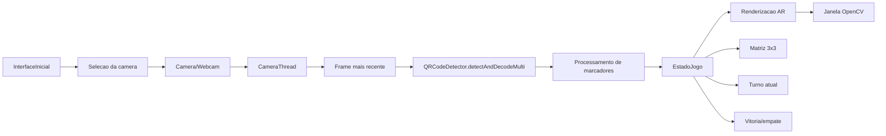
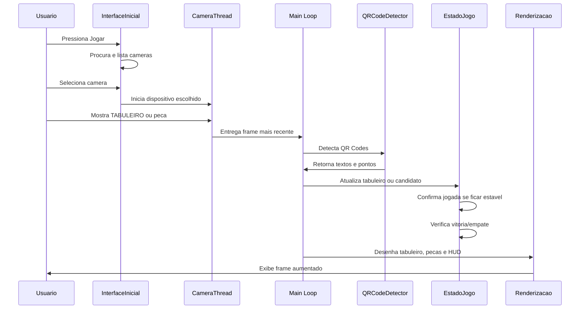

# TDD - Technical Design Document

## Projeto

**Nome:** Jogo da Velha AR com QR Code

**Contexto:** projeto de Computacao Grafica que combina Realidade Aumentada, Visao Computacional e renderizacao 2D em tempo real para executar uma partida de jogo da velha sobre a imagem capturada pela camera.

**Repositorio:** `jogo-da-velha-ar`

**Arquivo principal:** `jogo_da_velha_ar.py`

**Video demonstrativo:** https://youtu.be/0WJbqrRqtr0

## Objetivo

Desenvolver uma aplicacao em Python capaz de:

- apresentar uma interface grafica inicial em tela cheia;
- permitir a selecao visual da camera antes da partida;
- capturar video da camera em tempo real;
- detectar QR Codes usados como marcadores fiduciais;
- calibrar uma area virtual de tabuleiro;
- registrar jogadas de `X` e `O` em uma matriz 3x3;
- renderizar o tabuleiro e as pecas sobre a imagem real;
- detectar vitoria ou empate automaticamente;
- reduzir instabilidade causada por multiplos QR Codes visiveis ao mesmo tempo.

## Problema Tecnico

A versao inicial dependia da deteccao simultanea de varios QR Codes. Em um jogo da velha completo, isso poderia exigir ate 10 marcadores visiveis ao mesmo tempo: um marcador para o tabuleiro e ate nove marcadores para as jogadas.

Na pratica, isso causava:

- piscadas nos overlays;
- perda intermitente de marcadores;
- dificuldade de leitura quando marcadores ficavam proximos;
- dependencia excessiva do detector de QR Code em todos os frames;
- maior carga de processamento por frame.

## Solucao Proposta

A solucao atual usa uma estrategia de **estado persistente**.

O QR Code nao representa mais uma peca permanente na tela. Ele funciona como uma entrada temporaria de jogada. Depois que uma jogada e confirmada, o programa salva a posicao em memoria e passa a renderizar a peca diretamente no tabuleiro virtual.

Fluxo resumido:

1. O usuario aponta o QR Code `TABULEIRO`.
2. O sistema calcula e salva a area virtual do tabuleiro.
3. O usuario posiciona um QR Code `X` ou `O` em uma celula.
4. Se o marcador permanecer estavel por `TEMPO_CONFIRMACAO`, a jogada e registrada.
5. O QR Code fisico pode sair da camera.
6. O programa continua desenhando a peca salva naquela celula.
7. O turno alterna entre `X` e `O`.
8. O sistema verifica vitoria ou empate.

Na versao atual, `TEMPO_CONFIRMACAO = 2.0`.

## Arquitetura Geral



## Componentes

### `InterfaceInicial`

Responsavel pelo fluxo anterior a captura da camera.

Funcoes:

- abrir uma tela inicial em modo tela cheia;
- apresentar o botao `Jogar`;
- procurar cameras em uma thread de apoio para nao congelar a interface;
- permitir que o usuario escolha um dispositivo;
- fechar o menu e devolver o identificador da camera para o jogo.

O componente esta implementado em:

```text
interface_grafica.py
```

Tecnologia utilizada:

```text
tkinter
```

### `CameraThread`

Responsavel por capturar frames em uma thread separada.

Motivacao:

- evitar que a leitura da camera bloqueie o processamento principal;
- manter sempre o frame mais recente disponivel;
- reduzir travamentos perceptiveis na interface.

Principais atributos:

- `cap`: instancia de `cv2.VideoCapture`;
- `lock`: sincroniza acesso ao frame;
- `frame`: ultimo frame capturado;
- `running`: controla o ciclo da thread.

### `EstadoJogo`

Responsavel por manter o estado persistente da partida.

Armazena:

- `tabuleiro_pts`: quatro pontos da area virtual do tabuleiro;
- `celulas`: matriz 3x3 com `None`, `X` ou `O`;
- `jogador_atual`: jogador esperado no turno;
- `candidato`: jogada sendo analisada;
- `candidato_inicio`: inicio da estabilidade da jogada;
- `candidato_visto_em`: ultimo momento em que o marcador candidato foi visto;
- `vencedor`: vencedor atual, se houver;
- `empate`: estado de empate;
- `linha_vencedora`: celulas que formam a combinacao vencedora.

### Detector de QR Code

O sistema usa:

```python
detector = cv2.QRCodeDetector()
ok, decoded_info, points, _ = detector.detectAndDecodeMulti(frame)
```

O metodo ainda suporta multiplos marcadores no mesmo frame, mas a regra de negocio nao depende mais de rastrear todos os marcadores durante a partida inteira.

### Renderizacao AR

Responsavel por desenhar:

- fundo branco do tabuleiro;
- grade 3x3;
- animacao de varredura;
- pecas `X` e `O`;
- previa da jogada candidata;
- linha de vitoria;
- HUD com instrucoes.

## Modelo de Dados

### Matriz do jogo

```python
celulas = [
    [None, None, None],
    [None, None, None],
    [None, None, None],
]
```

Cada celula pode conter:

- `None`: celula vazia;
- `"X"`: jogada do jogador X;
- `"O"`: jogada do jogador O.

### Jogada candidata

```python
candidato = (simbolo, linha, coluna)
```

Exemplo:

```python
candidato = ("X", 0, 2)
```

Isso significa que o sistema detectou um QR Code `X` na primeira linha e terceira coluna, mas ainda esta aguardando estabilidade para confirmar.

## Fluxo de Execucao



## Calibracao do Tabuleiro

O QR Code `TABULEIRO` define uma area virtual quadrada maior que o marcador fisico.

Etapas:

1. Calcular o centro do QR Code.
2. Medir largura e altura do marcador.
3. Usar o maior valor como base.
4. Multiplicar por `TAMANHO_TABULEIRO`.
5. Criar quatro pontos externos da area virtual.

Funcao relacionada:

```python
calcular_tabuleiro_virtual(pts_marcador)
```

Constante relacionada:

```python
TAMANHO_TABULEIRO = 3.5
```

## Mapeamento de Peca para Celula

Para descobrir em qual celula o QR Code `X` ou `O` foi colocado, o sistema:

1. Calcula o centro do marcador.
2. Aplica transformacao de perspectiva do tabuleiro para um espaco normalizado 3x3.
3. Verifica se o ponto esta dentro dos limites.
4. Converte coordenadas continuas para linha e coluna.

Funcao relacionada:

```python
ponto_para_celula(tabuleiro_pts, ponto)
```

## Confirmacao de Jogada

A jogada nao e salva imediatamente. Ela precisa permanecer estavel na mesma celula por um tempo definido.

Constantes:

```python
TEMPO_CONFIRMACAO = 2.0
TOLERANCIA_PERDA_MARCADOR = 0.65
COOLDOWN_JOGADA = 0.8
```

Regras:

- a peca precisa ser do jogador atual;
- a celula precisa estar vazia;
- o mesmo candidato precisa ser visto de forma estavel;
- se o marcador sumir por mais que `TOLERANCIA_PERDA_MARCADOR`, o candidato expira;
- apos confirmar, existe um pequeno cooldown para evitar duplicidade.

Funcao relacionada:

```python
EstadoJogo.registrar_candidato()
```

## Regras do Jogo

O sistema verifica as oito combinacoes possiveis:

- 3 linhas;
- 3 colunas;
- 2 diagonais.

Funcao relacionada:

```python
verificar_vitoria(celulas)
```

Empate ocorre quando:

- todas as celulas estao preenchidas;
- nao existe vencedor.

## Interface e Controles

### Interface inicial

A aplicacao inicia com uma interface `tkinter` em tela cheia.

Fluxo:

1. Exibir identidade visual do jogo e botao `Jogar`.
2. Ao clicar, mostrar a tela de selecao de camera.
3. Procurar dispositivos em segundo plano.
4. Habilitar `Iniciar jogo` quando existir uma camera valida.
5. Encerrar o menu e iniciar a captura com o dispositivo escolhido.

Controles:

- `Jogar`: avanca para a selecao de camera;
- `Atualizar`: repete a busca por dispositivos;
- `Iniciar jogo`: confirma a camera;
- `F11`: alterna tela cheia;
- `ESC`: sai da tela cheia ou fecha a interface.

### Janela

A janela OpenCV da partida e criada em modo redimensionavel:

```python
cv2.WINDOW_NORMAL
cv2.WINDOW_FREERATIO
```

Isso permite que a imagem da camera ocupe todo o espaco quando a janela e maximizada.

### Atalhos

- `ESC`: encerra o programa;
- `R`: reinicia o estado da partida;
- `F`: alterna entre janela normal e tela cheia.

## Decisoes Tecnicas

### Persistencia de estado em vez de rastreamento continuo

Decisao: salvar jogadas confirmadas na matriz 3x3.

Motivo:

- reduz dependencia de deteccao simultanea de muitos QR Codes;
- melhora estabilidade visual;
- aproxima o projeto de uma logica real de jogo;
- facilita verificacao de vitoria e empate.

### QR Code como entrada temporaria

Decisao: usar `X` e `O` apenas para registrar a jogada.

Motivo:

- evita necessidade de manter QR Code fisico na camera;
- permite que a partida avance mesmo com apenas um marcador de peca por vez;
- reduz o problema de piscadas.

### Camera em thread separada

Decisao: manter captura em `CameraThread`.

Motivo:

- evita bloqueio da leitura da camera;
- separa captura e processamento;
- mantem arquitetura mais clara.

Observacao: o Python possui limitacoes de paralelismo por causa do GIL, mas a captura via OpenCV e parte do processamento sao executados em bibliotecas nativas, entao a separacao ainda ajuda na organizacao e responsividade.

## Plano de Testes

### Testes manuais

| Caso | Procedimento | Resultado esperado |
|---|---|---|
| Inicializacao | Executar `python jogo_da_velha_ar.py` | Interface inicial abre em tela cheia |
| Botao Jogar | Pressionar `Jogar` | Tela de selecao de camera aparece |
| Busca de cameras | Aguardar a busca | Dispositivos disponiveis aparecem na lista |
| Inicio da captura | Selecionar camera e pressionar `Iniciar jogo` | Interface fecha e janela OpenCV abre |
| Calibracao | Mostrar QR `TABULEIRO` | Grade 3x3 aparece sobre a camera |
| Registro de X | Posicionar QR `X` em uma celula vazia por 2s | Peca X e salva na celula |
| Registro de O | Posicionar QR `O` em uma celula vazia por 2s | Peca O e salva na celula |
| Turno incorreto | Mostrar `X` quando for turno de `O` | Jogada nao e confirmada |
| Celula ocupada | Mostrar qualquer peca em celula ocupada | Jogada nao e confirmada |
| Vitoria | Completar linha/coluna/diagonal | Sistema exibe vencedor e linha de vitoria |
| Empate | Preencher todas as celulas sem vencedor | Sistema exibe empate |
| Reinicio | Pressionar `R` | Estado volta ao inicio |
| Tela cheia | Pressionar `F` | Janela alterna tela cheia |
| Saida | Pressionar `ESC` | Programa fecha |

### Testes automatizados sugeridos

Criar testes unitarios para:

- `verificar_vitoria`;
- `ponto_para_celula`;
- `EstadoJogo.registrar_candidato`;
- `EstadoJogo.confirmar_jogada`;
- expiracao de candidato;
- alternancia de turno.

## Riscos e Limitacoes

| Risco | Impacto | Mitigacao |
|---|---|---|
| Iluminacao ruim | QR Code pode nao ser detectado | Usar boa iluminacao e QR impresso nitido |
| Movimento brusco | Candidato pode expirar | Manter marcador estavel por 2s |
| Tabuleiro mal calibrado | Peca pode cair na celula errada | Reapontar `TABULEIRO` ou reiniciar com `R` |
| Distancia alta da camera | Marcadores pequenos podem falhar | Aproximar marcador da camera |
| Oclusao do QR Code | Detector perde o marcador | Evitar cobrir o QR durante confirmacao |

## Melhorias Futuras

- Detectar uma grade fisica desenhada, removendo a dependencia do QR `TABULEIRO`.
- Estabilizar o tabuleiro com media temporal ou filtro exponencial.
- Adicionar sons ou feedback visual ao confirmar jogada.
- Criar placar.
- Separar o codigo em modulos (`camera.py`, `estado.py`, `render.py`, `detector.py`).
- Adicionar testes unitarios com `pytest`.
- Salvar logs da partida para demonstracao.

## Criterios de Aceite

O projeto sera considerado funcional quando:

- a interface inicial abrir em tela cheia;
- o botao `Jogar` abrir a selecao de camera;
- o usuario conseguir selecionar o dispositivo antes da captura;
- a camera abrir corretamente;
- o tabuleiro for calibrado com o QR `TABULEIRO`;
- uma jogada `X` ou `O` for confirmada apos 2 segundos;
- jogadas confirmadas continuarem visiveis mesmo sem o QR fisico;
- o turno alternar corretamente;
- vitoria e empate forem detectados;
- `R`, `F` e `ESC` funcionarem;
- a demonstracao em video mostrar uma partida completa ou quase completa.
